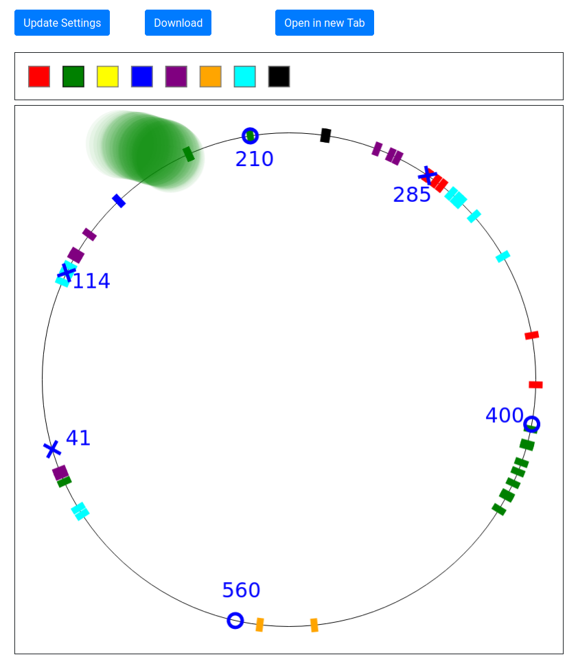

# Lake Visualizer

This application can be used to visualize the lake from the third task in the [second round of the 39th BWINF](https://github.com/christopher-besch/bwinf_39_round2).
You can use it [here](https://christopher-besch.github.io/lake_visualizer/public/index.html).

Click "Update Settings" to get started.
